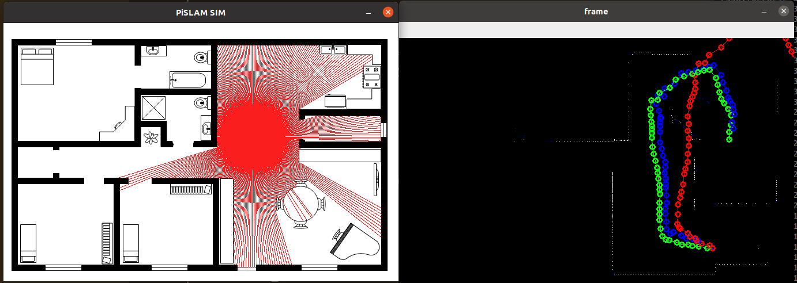

# PiSLAM
This is intended to be a lightweight 2D slam framework for educational purposes.  Some experiments can be found in visualization, but the actual SLAM sim is in PySLAM/world_sim.py

to run call `python3 world_sim.py`

click on the map to place a new robot waypoint.  True position in green, red is dead reckoning, and blue is graphslam output.

requires opencv, pyglet, and numpy

This is a very simple framework for fun than anything else.  It uses a graphslam approach without weights.  Features are based on sensor spikes.

The code is extremely unoptimized, but can still process hundreds of landmarks and positions in a few 100ms.

(note that the right image is inverted along the y axis)

# TODOs
I'm probably going to leave this project as is.  There isn't much reason to add much to it as SLAM is a very well "solved" problem with considerably better solutions than this one.  However, if improvements were to be made, the following would help:

- Overall refactoring of code to help clarity and organization
- Use of sparse matrices would allow dynamic additions instead of rebuilding the matrix every time
- Better feature identification
- Weighted measurements to rely more heavily on waypoints than deltas
- Graphical visualization cleaned up and separated into a separate module
- Use of KD-tree or quadtree (or just gridmap?!) to store landmarks to speed up landmark matching (likely a very large bottleneck) 